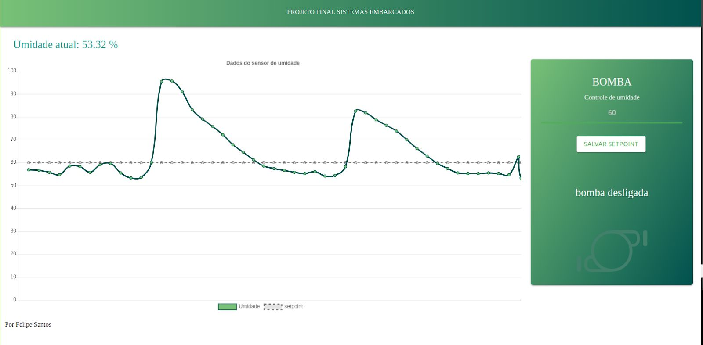

# Sistemas Embarcados - UFAM 2018/2

## Sobre

Este repositório conta com os projetos desenvolvidos por mim na disciplina Sistemas Embarcados ministrada na UFAM, cada pasta do repositório contem um PDF com a descrição da atividade proposta assim como os códigos das minhas soluções. No restante deste arquivo, é descrito o projeto final desenvolvido que pode ser encontrado com detalhes no diretório `./TF`.

# Sistema de Irrigação IoT

## Objetivo

Este projeto tem como objetivo abranger 3 dos 17 objetivos de desenvolvimento- sustentável da ONU, especificamente: o objetivo 2 que é **“Acabar com a fome, alcançar a segurança alimentar e melhoria da nutrição e promover a agricultura sustentável”**, visto que essa solução pode ser implantada de forma inteligente na agricultura, onde o sistema de irrigação passaria a ser acionado estritamente quando for necessário, utilizando a água destinada para esse fim de maneira eficiente; o objetivo 13 **“Tomar medidas urgentes para combater a mudança climática e seus impactos”** , pois preservando as condições de sobrevivência da vegetação, podemos obter um impacto sobre o aquecimento global; e o objetivo 15 **“Proteger, recuperar e promover o uso sustentável dos ecossistemas terrestres, gerir de forma sustentável as florestas, combater a desertificação, deter e reverter a degradação da terra e deter a perda de biodiversidade”** é possível combater a desertificação e a degradação da terra, com um uso em larga escala do conceito da irrigação inteligente.

## Proposta de Solução

A proposta do trabalho final consiste no monitoramento de um solo via rede wifi, ou- seja é um sistema de irrigação IoT, foi colocado em um recipiente um sensor de umidade, este sensor foi ligado em um NodeMCU (ESP8266), que envia em tempo real os valores medidos para um servidor local, feito em NodeJS, que exibe um gráfico com estes valores ao decorrer do tempo, em um determinado setpoint de umidade, este servidor envia um comando para o acionamento de uma bomba d´água para que a mesma irrigue o recipiente e desse modo a umidade do solo fique próximo aos entornos do que foi selecionado pelo usuário. Também é possível configurar via página web qual é o setpoint de umidade desejado.

## Material Utilizado

- **Sensor de Umidade YF-69**

  

Sensor de Umidade do Solo Higrômetro foi feito para detectar as variações de- umidade no solo. Quando o solo está seco, a saída do sensor fica em estado alto e quando úmido, a saída do sensor fica em estado baixo. O limite entre seco e úmido pode ser ajustado através do potenciômetro presente no sensor que regulará a saída digital D0. Contudo, para que fosse obtida resolução melhor, foi utilizada a saída analógica A0 conectada ao conversor AD presente no NodeMCU utilizado neste projeto.

- **Módulo Relé 3.3V**

  

Um módulo para fazer acionamento de cargas de 200V AC, como lâmpadas,- equipamentos eletrônicos, motores, ou usá-lo para fazer um isolamento entre um circuito e outro. O módulo é equipado com transistores, conectores, leds, diodos e um relé. Possui um LED para indicar o estado da saída do relé. Foi utilizado para o acionamento da Bomba d’água.

- **NodeMCU 0.1 LOLin**

  

Placa de desenvolvimento que combina o chip ESP8266, uma interface usb-serial e- um regulador de tensão 3.3V. A programação foi feita através da extensão Platformio no VisualStudio, utilizando a comunicação via cabo micro-usb. O NodeMCU possui antena embutida e conector micro-usb para conexão ao computador, além de 11 pinos de I/O e conversor analógico-digital.

- **Shield Base para NodeMCU**

  

Placa de expansão para ampliar a placa Esp8266 ESP-12E Nodemcu. Possui- combinações de pinos de forma a proporcionar

facilidade nas ligações da placa- microcontroladora. Para maiores possibilidades esta shield possui um conector P4 para alimentação externa, permitindo trabalhar com tensões DC entre 6 a 24V, além de possuir 4 perfurações para fixação.

-  **Bomba de aquário Atman AT-300**

  

Bomba submersa para aquários e fontes com grelha plástica, bico e ventosas, possui- saída de água de 8mm e vazão regulável até 180 l/h. Foi utilizada para irrigar o solo (algodão) do protótipo.

## Metodologia e resultados

Foi montado um protótipo que consiste em dois recipientes plásticos, onde a bomba- ficava submersa no recipiente inferior com água e quando ligada, leva a água através de uma mangueira para o recipiente superior, que está revestido com algodão e simula o solo a ser monitorado pelo sensor como nas figuras que seguem. 

  

    
  

O sensor foi ligado ao pino analógico A0 do NodeMCU e o módulo relé responsável- pelo chaveamento da bomba foi ligado ao pino digital D7. A programação foi feita de forma que o monitoramento também possa ser feito quando o controlador está desconectado da rede WiFi, sendo o servidor responsável apenas pela exibição dos dados coletados em um gráfico, e pelo armazenamento do valor de umidade desejado pelo usuário em um banco de dados, o escolhido neste caso foi o MongoDB, quando o ESP é conectado pela rede WiFi. Quando ele está offline o setpoint permanece sendo o último que foi configurado até o seu desligamento.

O servidor foi feito em Node.js, uma plataforma construída sobre o motor Javascript- do Google Chrome para a facilitação da construção de aplicações de rede escaláveis. Através das biblioteca Chart.js e Socket.io foi possível traçar gráfico em tempo real enquanto o servidor recebia pacotes TCP com as informações enviadas pelo ESP8266, ou seja como o sistema engloba basicamente dois dispositivos: um cliente (ESP8266) e o servidor (PC).

Optou-se por utilizar um protocolo baseado em socket TCP, onde eram enviados pacotes com informações que os significados eram revertidos em comandos entre o cliente e servidor, a fim de deixar a comunicação mais enxuta e manter ela funcional por um longo período de tempo.

A interface de usuário foi feita utilizando-se a combinação HTML, CSS e Javascript. O resultado pode ser visto na imagem a seguir:

Existe um indicativo do status atual da bomba, um label para mudar o valor do- setpoint além da exibição do gráfico de leituras de umidade em tempo real.

